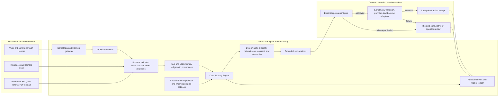

# VELA

**Your clearest path to care.**

VELA is a consent controlled healthcare action system built on NVIDIA DGX Spark. It turns a spoken care request and insurance documents into a verified, cost aware care path, then, with the user's explicit approval, takes action to secure the appointment. Under the interface is a multistep agentic workflow combining local reasoning, document retrieval, deterministic matching, cost calculations, tool use, recovery logic, and an auditable record of every consequential action.

VELA is a submission to the **Do Track** of the NVIDIA Spark Hack Series in Seattle.

> **Prototype boundary:** VELA does not provide medical advice, act as a licensed insurance broker, guarantee prices, perform production enrollment, cancel real coverage, or reserve a real clinical appointment. The submission uses seeded synthetic data and visibly sandboxed action adapters.

## Why VELA belongs in the Do Track

VELA does not stop at answering healthcare questions. It orchestrates a long running workflow across voice, documents, insurance data, provider data, cost models, consent gates, and booking tools to accomplish a task a patient would otherwise have to coordinate manually.

The demonstration includes branching logic and safe recovery:

- Ambiguous procedures trigger clarification instead of a guessed billing code.
- Missing or contradictory facts block the workflow instead of creating false certainty.
- Ineligible or out of network paths remain visible with rejection reasons.
- Model failure does not alter deterministic eligibility, cost, ranking, or consent rules.
- Duplicate sandbox action requests are idempotent and return the existing receipt.
- Enrollment, coverage transition, provider disclosure, and booking require separate exact scope approvals.

## The core loop

1. A user describes a care need by voice.
2. VELA prompts the user to scan an insurance card or upload insurance and referral PDFs.
3. NVIDIA Nemotron, reached through the authenticated Hermes gateway, proposes structured facts from language and documents.
4. The fact ledger records the value, source, timestamp, confidence, verification state, and consent requirement for every material fact.
5. Deterministic code evaluates eligibility, provider and medication constraints, and expected annual cost across three care paths.
6. VELA ranks only feasible paths and explains the result using the engine's authoritative evidence.
7. The user reviews the proposed action and grants exact consent.
8. Sandboxed adapters execute enrollment, coverage transition, provider verification, and appointment booking in the permitted sequence.
9. VELA displays receipts and an audit history that prove what happened.

## Controlled demo scenario

The golden path follows a fictional Washington resident who recently lost employer coverage and needs a nonemergency knee MRI. VELA compares continuation coverage with two eligible Washington alternatives, preserves a required medication and preferred physician, selects the lowest expected annual cost feasible path, and completes a sandbox appointment booking.

Expected annual cost is calculated as:

```text
annual premiums
+ expected out of pocket care
+ medication costs
+ remaining deductible exposure
```

The cheapest procedure price is not necessarily the cheapest complete care path.

## Architecture



The model handles language heavy work such as extraction, classification, normalization, summarization, and explanation. Deterministic application code owns arithmetic, eligibility, network constraints, ranking, consent enforcement, state transitions, and action authorization. Model output is never treated as authoritative until it passes schema and rule validation.

See [docs/ARCHITECTURE.md](docs/ARCHITECTURE.md) for component boundaries, action sequencing, recovery behavior, and the DGX Spark story.

## NVIDIA and DGX Spark

VELA runs NVIDIA Nemotron locally on an Acer Veriton GN100 powered by NVIDIA GB10. Application model calls pass through the authenticated NemoClaw Hermes gateway rather than calling vLLM directly.

DGX Spark matters to VELA because it enables:

- Local inference for workflows that may contain sensitive insurance and care context.
- The model, retrieval context, workflow state, and document processing pipeline to operate together on one local system.
- Predictable low latency for a conversational, multistep workflow.
- A fail closed trust boundary with controlled model and network access through NemoClaw.
- Continued deterministic evaluation and safe blocking when the model is unavailable.

Current local model:

```text
nvidia/NVIDIA-Nemotron-3.5-Lightning-30B-A3B-NVFP4
```

## Quick start

### Requirements

- Python 3.11 or newer
- Node.js 20 or newer
- npm
- Optional authorized access to the team DGX Spark for live Nemotron explanations

### 1. Clone and configure

```bash
git clone https://github.com/abhinavm27/abyss.git
cd abyss
git switch codex/migrate-implementation
cp .env.example .env
```

The seeded deterministic engine and its tests require no credentials. Live Nemotron explanations require the private Hermes connection described in [docs/HERMES_CONNECTION.md](docs/HERMES_CONNECTION.md).

### 2. Run the deterministic test suite

```bash
PYTHONPATH=src python3 -m unittest discover -s tests -v
```

### 3. Run the API

```bash
python3 -m venv .venv
.venv/bin/pip install -e . -e 'services/api[dev]'
PYTHONPATH=src:services/api .venv/bin/uvicorn app.api:app --port 8010
```

### 4. Run the web application

In a second terminal:

```bash
cd apps/web
npm ci
npm run dev
```

Open `http://localhost:5173`.

### Interface only demo mode

To inspect the interface without the API:

```bash
cd apps/web
VITE_DEMO_MODE=true npm run dev
```

Demo mode uses controlled client side fixtures and must not be presented as evidence that external actions occurred.

## Reproduce the judged demo

Follow [docs/DEMO_RUNBOOK.md](docs/DEMO_RUNBOOK.md). It defines the seeded inputs, expected decisions, required consent records, sandbox actions, success conditions, recovery cases, and truthful fallback behavior.

## Data and provenance

The hackathon journey uses seeded synthetic patient, plan, provider, and action data. The repository contains no real patient or insurance documents. See [docs/DATA_PROVENANCE.md](docs/DATA_PROVENANCE.md) for every demo data class, its origin, transformations, authority, and known gaps.

## Security and consent

- Secrets, real uploaded documents, private keys, and runtime state are excluded from version control.
- Every consequential action requires a matching consent record with an exact scope.
- Coverage transition is blocked until the replacement effective date and first premium are confirmed.
- External action adapters are sandboxed and idempotent.
- Material facts retain provenance and verification state.
- Audit views are redacted and sandbox actions are visibly labeled.

Read [docs/SECURITY.md](docs/SECURITY.md) before handling any document or connecting to the DGX Spark.

## Known limitations

- Enrollment, coverage transition, provider verification, and booking use sandbox adapters.
- Cost results are estimates and are not guarantees of benefits or patient responsibility.
- The golden path is intentionally scoped to one synthetic Washington MRI journey.
- Plan and provider catalogs are controlled fixtures rather than complete live payer directories.
- Insurance card scans cannot establish full benefits; an SBC or equivalent source is required for cost sharing details.
- Document formats and voice accuracy vary, and ambiguous inputs may require user clarification.
- VELA does not diagnose conditions or recommend clinical treatment.
- Production use would require payer and provider integrations, formal security and compliance validation, persistent encrypted storage, monitoring, and human escalation.

## Next steps

- Expand the evaluation set for extraction, ranking explanations, consent enforcement, and recovery behavior.
- Add authoritative payer eligibility and provider scheduling integrations behind the existing adapter contracts.
- Expand beyond the controlled Seattle and Washington catalogs.
- Add multilingual speech and accessibility preference evaluation.
- Persist the event ledger and encrypted user memory outside the process local demo store.
- Conduct formal threat modeling, privacy review, accessibility testing, and clinical safety review.

## Repository map

```text
apps/web/                  React, Vite, and Capacitor user experience
services/api/              FastAPI, document ingestion, pricing, and journey API
src/abyss/                 Deterministic domain, agents, workflow, and adapters
scenarios/wa_mri/          Seeded synthetic golden path fixture
docs/ARCHITECTURE.md       System, authority, trust, and recovery boundaries
docs/DEMO_RUNBOOK.md       Reproducible judged demo and expected outcomes
docs/DATA_PROVENANCE.md    Dataset inventory, provenance, and limitations
docs/SUBMISSION_CHECKLIST.md Repository readiness and remaining submission work
docs/DEMO_TRUTH.md         Working, sandboxed, and prohibited claims
docs/SECURITY.md           Repository, infrastructure, and product safeguards
tests/                     Deterministic unit and vertical slice tests
```

## Team VELA

| Team member | Role |
| --- | --- |
| Abishek Muralikrishna | Role and contact to be confirmed |
| Abhinav Ravindran | Role and contact to be confirmed |
| Fatima Aguilar | Role and contact to be confirmed |

## Submission links

- Demo video: To be added
- Deployed application: To be added
- Repository: [github.com/abhinavm27/abyss](https://github.com/abhinavm27/abyss)

## License

No license has been declared for this hackathon prototype. All rights are reserved by the contributors unless a license is added.
