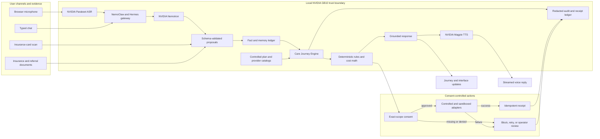

# VELA

**Your clearest path to care.**

[](https://github.com/abhinavm27/abyss/actions/workflows/ci.yml)

VELA is a voice-first, consent-controlled healthcare action system built for the NVIDIA Spark Hack Series in Seattle. It connects three complete journeys: an NVIDIA-powered voice conversation, an insurance decision and coverage transition, and appointment booking or rescheduling. Every consequential action remains behind exact user consent.

VELA is a **Do Track** prototype. It demonstrates an end-to-end workflow; it does not provide medical advice, act as a licensed insurance broker, guarantee prices, perform production enrollment, cancel real coverage, or reserve a real clinical appointment. All demo identities and records are seeded synthetic data.

## Judge VELA in 60 seconds

| Question | Answer |
| --- | --- |
| What problem does VELA solve? | Patients should not have to coordinate insurance, provider search, cost comparison, consent, and scheduling alone. |
| What does it complete? | A live voice request becomes an insurance decision, a controlled coverage transition, and a sandbox appointment with persistent receipts. |
| What is technically different? | NVIDIA Nemotron handles language-heavy work. Deterministic code owns eligibility, cost, network constraints, ranking, consent, and action authorization. |
| Why NVIDIA? | Local inference on GB10 keeps the model, retrieval context, documents, and workflow state inside one controlled system. NemoClaw, OpenShell, and Hermes govern model access and execution. |
| What proves it works? | A reproducible Washington MRI journey, a live Parakeet-to-Nemotron-to-Magpie voice path, explicit consent records, idempotent booking receipts, and deterministic and vertical-slice tests. |

VELA targets the **Nemotron Lightning** and **NemoClaw and OpenShell** bounties.

### What is working

- Voice and document intake using seeded synthetic data
- Three-path expected annual-cost comparison
- Deterministic eligibility, medication, physician, provider, and network constraints
- Exact-scope consent records for every consequential action
- Controlled provider verification
- Sandbox enrollment, coverage transition, appointment booking, and rescheduling
- Idempotent receipts, bounded recovery, and an auditable journey history

## Three complete product journeys

### 1. Voice-first care navigation

VELA provides a persistent, bidirectional voice experience rather than a speech-to-text shortcut:

1. The browser streams 16 kHz microphone audio over the authenticated WebSocket.
2. **NVIDIA Parakeet** transcribes the utterance.
3. The Care Journey Agent routes the transcript through **Hermes/Nemotron** and the deterministic workflow.
4. VELA returns grounded text, journey-state updates, and interface events.
5. **NVIDIA Magpie** synthesizes the approved response and streams 22.05 kHz audio back to the browser.

Voice sessions include proactive prompts, visible listening/transcribing/thinking/speaking states, persisted transcripts, correlation IDs, safe recovery, and a typed-chat fallback. Nemotron may interpret and explain language; it cannot authorize an action or change a deterministic result.

### 2. Insurance decision and coverage transition

VELA turns insurance evidence into a decision the user can inspect:

- Processes synthetic insurance-card images, Summary of Benefits and Coverage documents, and referrals.
- Records material facts with source, timestamp, confidence, verification status, and consent requirements.
- Supports conversational plan discovery and plan-comparison requests.
- Compares continuation coverage with two Washington alternatives in the golden scenario.
- Applies deterministic Special Enrollment, medication, physician, provider, network, effective-date, and annual-cost rules.
- Shows infeasible paths and rejection reasons instead of hiding them.
- Requires separate exact consent for sandbox enrollment and coverage transition.
- Prevents old coverage from ending until the replacement effective date and first-premium conditions are confirmed.

### 3. Appointment booking and rescheduling

VELA continues beyond the coverage decision into a consent-controlled scheduling workflow:

- Verifies the selected provider through a controlled adapter, supervised call, or clearly labeled recording.
- Collects scheduling preferences and returns matching synthetic appointment slots.
- Binds exact booking consent to the selected plan, provider, facility, date, and time.
- Persists the appointment and an idempotent sandbox receipt across refreshes.
- Supports bounded retries when the booking adapter reports a transient failure.
- Reschedules safely by confirming the replacement before cancelling the original appointment, with separate consent for both actions.

### How the journeys connect

The judged path follows a fictional Washington resident who recently lost employer coverage and needs a non-emergency knee MRI:

```text
voice request
-> insurance and referral evidence
-> three-path coverage comparison
-> lowest-cost feasible path
-> exact enrollment and transition consent
-> controlled provider verification
-> slot selection and exact booking consent
-> persistent sandbox appointment receipt
```

Expected annual cost is computed deterministically from:

```text
annual premiums
+ expected out-of-pocket care
+ medication costs
+ remaining deductible exposure
```

The cheapest individual procedure is not necessarily the lowest-cost complete care path.

> **Evidence boundary:** A sandbox receipt proves that the VELA workflow and adapter executed. It does not prove that an insurer or provider changed a real external record. Estimates are not guaranteed prices, and controlled provider verification is not a live directory guarantee.

## System design



### Decision authority

| Concern | Model-assisted | Deterministic authority |
| --- | ---: | ---: |
| Extract and normalize user language | Yes | Validates the schema and accepted values |
| Classify intent and summarize evidence | Yes | Selects allowed transitions and actions |
| Calculate expected annual cost | No | Yes |
| Evaluate eligibility and constraints | No | Yes |
| Rank feasible care paths | No | Yes |
| Enforce consent and idempotency | No | Yes |
| Explain an authoritative result | Yes | Supplies the evidence and blocks unsupported output |

Model output is untrusted until it passes schema and rule validation. A model cannot override cost calculations, eligibility gates, network constraints, consent, workflow state, or action authorization.

## NVIDIA stack

VELA runs its model and speech path on an Acer Veriton GN100 powered by NVIDIA GB10.

| Component | Role in VELA |
| --- | --- |
| NVIDIA Parakeet | Local automatic speech recognition for live user audio |
| NVIDIA Nemotron | Language extraction, classification, normalization, and grounded explanation |
| NVIDIA Magpie | Streamed speech synthesis for the grounded assistant response |
| NemoClaw and OpenShell | Policy boundary for controlled model and network execution |
| Hermes | Authenticated gateway used by every application model call |
| NVIDIA GB10 | Local compute for inference, speech, retrieval context, and workflow state |

The current reasoning model is:

```text
nvidia/NVIDIA-Nemotron-3.5-Lightning-30B-A3B-NVFP4
```

The application never bypasses NemoClaw by calling vLLM directly. Local execution keeps inference, speech, retrieval context, document processing, and workflow state within one controlled system. If a model is unavailable or returns invalid output, deterministic evaluation continues where possible and consequential actions fail closed.

## Quick start

### Requirements

- Python 3.11 or newer
- Node.js 22, pinned in `.nvmrc`
- npm

Live Nemotron explanations additionally require authorized access to the private Hermes gateway. The seeded deterministic workflow and its tests require no model credentials.

### Install

```bash
git clone https://github.com/abhinavm27/abyss.git
cd abyss
python3 -m venv .venv
.venv/bin/python -m pip install -e . -e 'services/api[dev]'
npm --prefix apps/web ci
cp .env.example .env
```

Never commit `.env`, credentials, uploaded documents, runtime databases, or real health or insurance data.

### Validate

```bash
PYTHONPATH=src .venv/bin/python -m unittest discover -s tests -v
PYTHONPATH=src:services/api .venv/bin/python -m unittest discover -s services/api/tests -v
npm --prefix apps/web test -- --run
npm --prefix apps/web run typecheck
npm --prefix apps/web run build
```

### Run locally

Start the API:

```bash
PYTHONPATH=src:services/api .venv/bin/uvicorn app.api:app --port 8010
```

Start the web application in a second terminal:

```bash
npm --prefix apps/web run dev
```

Open `http://localhost:5173`.

For an interface-only demonstration without the API:

```bash
VITE_DEMO_MODE=true npm --prefix apps/web run dev
```

Demo mode uses controlled client-side fixtures. It is not evidence that an external action occurred.

### Full voice runtime

The complete voice path additionally requires the authenticated Hermes gateway, NVIDIA Parakeet ASR, NVIDIA Magpie TTS, and a secure browser context for microphone access. The GN100 endpoints, health checks, deployment order, and local voice tunnel are documented in [`docs/BUILD_AND_DEPLOY_RUNBOOK.md`](docs/BUILD_AND_DEPLOY_RUNBOOK.md).

## Reproduce the demonstration

Follow [`docs/DEMO_RUNBOOK.md`](docs/DEMO_RUNBOOK.md) for the seeded inputs, expected comparison, consent scopes, sandbox actions, recovery cases, and success conditions. Deployment and GN100 verification are documented in [`docs/BUILD_AND_DEPLOY_RUNBOOK.md`](docs/BUILD_AND_DEPLOY_RUNBOOK.md).

## Repository structure

```text
apps/web/                    React, Vite, and Capacitor interface
services/api/                FastAPI, ingestion, retrieval, and journey API
src/abyss/                   Domain contracts, deterministic engine, and agents
scenarios/wa_mri/            Seeded Washington MRI demonstration
tests/                       Domain and vertical-slice tests
services/api/tests/          API contract and integration tests
docs/                        Architecture, operations, safety, and demo evidence
scripts/                     Validation and GN100 operational tooling
deploy/                      Service deployment definitions
.github/workflows/ci.yml     Continuous validation
```

Key references:

- [`docs/ARCHITECTURE.md`](docs/ARCHITECTURE.md): component, authority, and trust boundaries
- [`docs/DEMO_TRUTH.md`](docs/DEMO_TRUTH.md): approved claims and sandbox boundaries
- [`docs/DATA_PROVENANCE.md`](docs/DATA_PROVENANCE.md): source inventory and limitations
- [`docs/SECURITY.md`](docs/SECURITY.md): repository and runtime safeguards
- [`docs/HERMES_CONNECTION.md`](docs/HERMES_CONNECTION.md): authenticated model path
- [`docs/SUBMISSION_CHECKLIST.md`](docs/SUBMISSION_CHECKLIST.md): evidence and readiness tracker

## Product and repository naming

**VELA** is the product name presented to users and judges. The repository name, Python package, environment-variable prefix, database identifiers, service names, and deployment paths retain the original **ABYSS** namespace. Those internal identifiers remain intentionally stable to protect imports, configuration, stored state, scripts, and active integrations.

## Safety and limitations

- Enrollment, coverage transition, provider verification, and booking use controlled or sandboxed adapters.
- Provider verification may use a controlled endpoint, supervised call, or clearly labeled recording when the external seam is unavailable.
- Cost results are estimates, not guarantees of benefits or patient responsibility.
- Plan and provider catalogs are controlled fixtures, not complete live directories.
- Insurance-card data alone cannot establish complete benefits; cost sharing requires an SBC or equivalent source.
- Ambiguous inputs remain unresolved until the user or an authoritative source supplies the missing fact.
- VELA does not diagnose conditions or recommend clinical treatment.
- Production use would require authorized payer and provider integrations, formal privacy and security review, compliant encrypted persistence, monitoring, accessibility validation, and human escalation.

## Team VELA

| Team member | Role | Contact |
| --- | --- | --- |
| Abishek Muralikrishna | AI Systems and NVIDIA Integration Lead | [Email](mailto:Abishek.bm@gmail.com) |
| Abhinav Ravindran | Agentic Systems and Backend Architecture Lead | [Email](mailto:abhinav.ravindran27@gmail.com) |
| Fatima Aguilar | Product, UX, and Frontend Lead | [Email](mailto:fsaguilar16@gmail.com) |

## Submission links

- Demo video: Pending final recording and signed-out verification
- Deployed application: [Open the VELA interface](https://vela-care-path.fsaguilar16.chatgpt.site/)
- Source repository: [github.com/abhinavm27/abyss](https://github.com/abhinavm27/abyss)

## License

No license has been declared for this hackathon prototype. All rights are reserved by the contributors unless a license is added.
