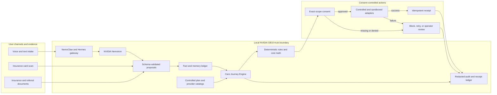

# VELA

**Your clearest path to care.**

[](https://github.com/abhinavm27/abyss/actions/workflows/ci.yml)

VELA is a consent-controlled healthcare action system built for the NVIDIA Spark Hack Series in Seattle. It turns a care request and insurance evidence into a source-backed care path, compares feasible coverage options, and executes controlled sandbox actions only after the user gives exact consent.

VELA is a **Do Track** prototype. It demonstrates an end-to-end workflow; it does not provide medical advice, act as a licensed insurance broker, guarantee prices, perform production enrollment, cancel real coverage, or reserve a real clinical appointment. All demo identities and records are seeded synthetic data.

## Judge VELA in 60 seconds

| Question | Answer |
| --- | --- |
| What problem does VELA solve? | Patients should not have to coordinate insurance, provider search, cost comparison, consent, and scheduling alone. |
| What does it complete? | One conversational request becomes a sourced care-path comparison, an explicit user decision, and consent-gated sandbox actions with receipts. |
| What is technically different? | NVIDIA Nemotron handles language-heavy work. Deterministic code owns eligibility, cost, network constraints, ranking, consent, and action authorization. |
| Why NVIDIA? | Local inference on GB10 keeps the model, retrieval context, documents, and workflow state inside one controlled system. NemoClaw, OpenShell, and Hermes govern model access and execution. |
| What proves it works? | A reproducible Washington MRI journey, deterministic and vertical-slice tests, explicit consent records, idempotent receipts, and a responsive interface with recovery behavior. |

VELA targets the **Nemotron Lightning** and **NemoClaw and OpenShell** bounties.

### Working with controlled inputs

- Conversational voice and text intake
- Synthetic insurance-card and referral processing
- Personal Care Twin fact and memory state
- Three-path expected annual-cost comparison
- Eligibility, medication, physician, provider, and network constraints
- Source, timestamp, confidence, verification, and consent metadata for material facts
- Exact-scope consent records and an auditable journey history

### Controlled or sandboxed external actions

- Provider verification through a controlled adapter, supervised call, or clearly labeled recording
- Plan enrollment submission
- Existing-coverage transition
- Appointment booking

A sandbox receipt proves that the VELA workflow and adapter executed. It does not prove that an insurer or provider changed a real external record.

## Golden journey

The judged scenario follows a fictional Washington resident who recently lost employer coverage and needs a non-emergency knee MRI. VELA:

1. Collects the request and synthetic insurance evidence.
2. Resolves missing or ambiguous facts without guessing.
3. Compares continuation coverage with two eligible Washington alternatives.
4. Enforces medication, physician, provider, network, and effective-date constraints.
5. Selects the lowest expected annual-cost feasible path.
6. Requests separate consent for enrollment, transition, provider disclosure, and booking.
7. Completes controlled sandbox actions and records idempotent receipts.

Expected annual cost is computed deterministically from:

```text
annual premiums
+ expected out-of-pocket care
+ medication costs
+ remaining deductible exposure
```

The cheapest individual procedure is not necessarily the lowest-cost complete care path.

## System design



### Decision authority

| Concern | Model-assisted | Deterministic authority |
| --- | ---: | ---: |
| Extract and normalize user language | Yes | Validates the schema and accepted values |
| Classify intent and summarize evidence | Yes | Selects allowed transitions and actions |
| Calculate expected annual cost | No | Yes |
| Evaluate eligibility and constraints | No | Yes |
| Rank feasible care paths | No | Yes |
| Enforce consent and idempotency | No | Yes |
| Explain an authoritative result | Yes | Supplies the evidence and blocks unsupported output |

Model output is untrusted until it passes schema and rule validation. A model cannot override cost calculations, eligibility gates, network constraints, consent, workflow state, or action authorization.

## NVIDIA stack

VELA runs NVIDIA Nemotron locally on an Acer Veriton GN100 powered by NVIDIA GB10. Application model calls use the authenticated NemoClaw Hermes gateway; the application never bypasses that boundary by calling vLLM directly.

```text
nvidia/NVIDIA-Nemotron-3.5-Lightning-30B-A3B-NVFP4
```

Local execution keeps inference, retrieval context, document processing, and workflow state within one controlled system. If the model is unavailable or returns invalid output, deterministic evaluation continues where possible and consequential actions fail closed.

## Quick start

### Requirements

- Python 3.11 or newer
- Node.js 22, pinned in `.nvmrc`
- npm

Live Nemotron explanations additionally require authorized access to the private Hermes gateway. The seeded deterministic workflow and its tests require no model credentials.

### Install

```bash
git clone https://github.com/abhinavm27/abyss.git
cd abyss
python3 -m venv .venv
.venv/bin/python -m pip install -e . -e 'services/api[dev]'
npm --prefix apps/web ci
cp .env.example .env
```

Never commit `.env`, credentials, uploaded documents, runtime databases, or real health or insurance data.

### Validate

```bash
PYTHONPATH=src .venv/bin/python -m unittest discover -s tests -v
PYTHONPATH=src:services/api .venv/bin/python -m unittest discover -s services/api/tests -v
npm --prefix apps/web test -- --run
npm --prefix apps/web run typecheck
npm --prefix apps/web run build
```

### Run locally

Start the API:

```bash
PYTHONPATH=src:services/api .venv/bin/uvicorn app.api:app --port 8010
```

Start the web application in a second terminal:

```bash
npm --prefix apps/web run dev
```

Open `http://localhost:5173`.

For an interface-only demonstration without the API:

```bash
VITE_DEMO_MODE=true npm --prefix apps/web run dev
```

Demo mode uses controlled client-side fixtures. It is not evidence that an external action occurred.

## Reproduce the demonstration

Follow [`docs/DEMO_RUNBOOK.md`](docs/DEMO_RUNBOOK.md) for the seeded inputs, expected comparison, consent scopes, sandbox actions, recovery cases, and success conditions. Deployment and GN100 verification are documented in [`docs/BUILD_AND_DEPLOY_RUNBOOK.md`](docs/BUILD_AND_DEPLOY_RUNBOOK.md).

## Repository structure

```text
apps/web/                    React, Vite, and Capacitor interface
services/api/                FastAPI, ingestion, retrieval, and journey API
src/abyss/                   Domain contracts, deterministic engine, and agents
scenarios/wa_mri/            Seeded Washington MRI demonstration
tests/                       Domain and vertical-slice tests
services/api/tests/          API contract and integration tests
docs/                        Architecture, operations, safety, and demo evidence
scripts/                     Validation and GN100 operational tooling
deploy/                      Service deployment definitions
.github/workflows/ci.yml     Continuous validation
```

Key references:

- [`docs/ARCHITECTURE.md`](docs/ARCHITECTURE.md): component, authority, and trust boundaries
- [`docs/DEMO_TRUTH.md`](docs/DEMO_TRUTH.md): approved claims and sandbox boundaries
- [`docs/DATA_PROVENANCE.md`](docs/DATA_PROVENANCE.md): source inventory and limitations
- [`docs/SECURITY.md`](docs/SECURITY.md): repository and runtime safeguards
- [`docs/HERMES_CONNECTION.md`](docs/HERMES_CONNECTION.md): authenticated model path
- [`docs/SUBMISSION_CHECKLIST.md`](docs/SUBMISSION_CHECKLIST.md): evidence and readiness tracker

## Product and repository naming

**VELA** is the product name presented to users and judges. The repository name, Python package, environment-variable prefix, database identifiers, service names, and deployment paths retain the original **ABYSS** namespace. Those internal identifiers remain intentionally stable to protect imports, configuration, stored state, scripts, and active integrations.

## Safety and limitations

- Enrollment, coverage transition, provider verification, and booking use controlled or sandboxed adapters.
- Provider verification may use a controlled endpoint, supervised call, or clearly labeled recording when the external seam is unavailable.
- Cost results are estimates, not guarantees of benefits or patient responsibility.
- Plan and provider catalogs are controlled fixtures, not complete live directories.
- Insurance-card data alone cannot establish complete benefits; cost sharing requires an SBC or equivalent source.
- Ambiguous inputs remain unresolved until the user or an authoritative source supplies the missing fact.
- VELA does not diagnose conditions or recommend clinical treatment.
- Production use would require authorized payer and provider integrations, formal privacy and security review, compliant encrypted persistence, monitoring, accessibility validation, and human escalation.

## Team VELA

| Team member | Role | Contact |
| --- | --- | --- |
| Abishek Muralikrishna | AI Systems and NVIDIA Integration Lead | [Email](mailto:Abishek.bm@gmail.com) |
| Abhinav Ravindran | Backend and Healthcare Data Engineering Lead | [Email](mailto:abhinav.ravindran27@gmail.com) |
| Fatima Aguilar | Product, UX, and Frontend Lead | [Email](mailto:fsaguilar16@gmail.com) |

## Submission links

- Demo video: Pending final recording and signed-out verification
- Deployed application: [Open the VELA interface](https://vela-care-path.fsaguilar16.chatgpt.site/)
- Source repository: [github.com/abhinavm27/abyss](https://github.com/abhinavm27/abyss)

## License

No license has been declared for this hackathon prototype. All rights are reserved by the contributors unless a license is added.
