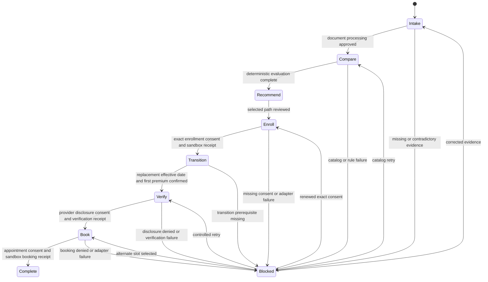

# VELA architecture

## System objective

VELA converts a spoken care request and user supplied insurance evidence into a source backed care path, requests exact consent for consequential actions, and completes a controlled sandbox appointment workflow. One Care Journey Engine owns the state machine and all authoritative decisions. Agents are bounded capabilities around that engine.

## End to end architecture

```mermaid
flowchart LR
    subgraph CHANNELS["Channels and documents"]
        USER["User"]
        VOICE["Voice and Hermes transport"]
        CARD["Insurance card camera scan"]
        FILES["SBC, referral, and insurance PDF upload"]
        USER --> VOICE
        USER --> CARD
        USER --> FILES
    end

    subgraph DGX["Acer Veriton GN100 and NVIDIA DGX Spark trust boundary"]
        NEMOCLAW["NemoClaw and OpenShell policy boundary"]
        HERMES["Authenticated Hermes gateway"]
        NEMOTRON["NVIDIA Nemotron local inference"]
        INTAKE["Onboarding and document extraction agent"]
        VALIDATE["Closed schema validation and redaction"]
        MEMORY["Versioned fact and user memory ledger"]
        ENGINE["Care Journey Engine"]
        PLANS["Washington plan and benefit catalog"]
        PROVIDERS["Seattle provider, network, and price catalog"]
        RULES["Deterministic eligibility, network, cost, consent, and state rules"]
        EXPLAIN["Grounded explanation agent"]
        AUDIT["Redacted audit and receipt ledger"]

        NEMOCLAW --> HERMES --> NEMOTRON
        NEMOTRON --> INTAKE --> VALIDATE
        VALIDATE --> MEMORY
        MEMORY --> ENGINE
        PLANS --> ENGINE
        PROVIDERS --> ENGINE
        ENGINE --> RULES
        RULES --> EXPLAIN
        ENGINE --> AUDIT
    end

    subgraph EXECUTION["Consent controlled action boundary"]
        REVIEW["Ranked care paths, reasons, sources, and caveats"]
        CONSENT["Exact action and scope consent gate"]
        ENROLL["Sandbox enrollment adapter"]
        TRANSITION["Sandbox coverage transition adapter"]
        VERIFY["Controlled provider verification adapter"]
        BOOK["Sandbox booking adapter"]
        RECEIPTS["Idempotent action receipts"]
        BLOCKED["Blocked state, bounded retry, or operator review"]

        REVIEW --> CONSENT
        CONSENT -->|"approved for exact scope"| ENROLL
        ENROLL --> TRANSITION --> VERIFY --> BOOK --> RECEIPTS
        CONSENT -->|"missing, expired, or denied"| BLOCKED
        ENROLL -->|"failure"| BLOCKED
        TRANSITION -->|"failure"| BLOCKED
        VERIFY -->|"failure"| BLOCKED
        BOOK -->|"failure"| BLOCKED
    end

    VOICE --> HERMES
    CARD --> INTAKE
    FILES --> INTAKE
    EXPLAIN --> REVIEW
    RECEIPTS --> AUDIT
    BLOCKED --> AUDIT
```



## Components

| Component | Responsibility | Authority boundary |
| --- | --- | --- |
| Communication adapter | Normalize voice, typed, and messaging events | Cannot determine eligibility or invoke action adapters |
| Onboarding agent | Extract candidate facts, classify documents, and identify missing information | Candidate facts remain unverified until validated or confirmed |
| Document ingestion | Accept camera images and PDFs, parse supported fields, and retain provenance | Cannot infer benefits that are absent from the source document |
| Fact and memory ledger | Preserve known, inferred, missing, contradictory, verified, and superseded facts | Never overwrites history or silently promotes confidence |
| Catalog services | Retrieve controlled plan, benefit, provider, network, and price records | Retrieval only; catalogs do not make recommendations |
| Care Journey Engine | Coordinate commands, facts, evaluations, consent, adapters, and events | Sole workflow authority |
| Deterministic rules | Calculate annual cost and enforce eligibility, network, consent, and state rules | Model output cannot override a rule result |
| Explanation agent | Explain authoritative evaluations and rejection reasons in plain language | Cannot change evaluation results or authorize actions |
| Sandbox adapters | Simulate enrollment, transition, provider verification, and booking | Require exact consent, valid stage, and idempotency key |
| Audit ledger | Record facts, approvals, state changes, failures, and action receipts | Read only to user and review agents |

## Local NVIDIA execution

```text
Web or iPhone application
        |
        | authenticated application request
        v
VELA Care Journey Engine
        |
        | OpenAI compatible request over a private SSH tunnel
        v
NemoClaw Hermes gateway on the GN100
        |
        | policy controlled local inference
        v
NVIDIA Nemotron 3.5 Lightning on NVIDIA GB10
```

The application never calls the vLLM server directly. Tailscale and SSH protect access to the host. The Hermes token authenticates the application. NemoClaw controls model and network execution. VELA separately enforces healthcare domain consent, evidence, and state rules. No single layer replaces another.

DGX Spark is useful here because VELA can keep the model, retrieval context, document processing, and long running workflow state on a local system. That reduces the need to transmit sensitive care and insurance context to a hosted model and provides predictable conversational latency. Deterministic comparison continues to function if Nemotron is unavailable, while language dependent steps fail closed or request operator review.

## Model and deterministic responsibility split

### NVIDIA Nemotron may

- Extract candidate facts from a conversation or supported document.
- Classify closed set intents and document types.
- Normalize procedure, plan, provider, and facility names.
- Identify ambiguity and propose a clarification question.
- Explain deterministic evaluations using supplied evidence.
- Summarize an audit history without changing it.

### NVIDIA Nemotron may not

- Calculate authoritative annual costs.
- Decide eligibility or network status.
- Rank plans or providers.
- Mark evidence verified.
- Approve consent.
- Advance workflow state.
- Execute enrollment, coverage transition, disclosure, or booking.

Every model response is treated as untrusted input. VELA validates it against a closed schema, rejects unknown actions, permits at most one bounded corrective retry, and moves repeated failures into a visible blocked or operator review state.

## Fact provenance

Every material fact carries:

```text
fact identifier
name and value
source
observed timestamp
confidence
verification status
consent requirement
optional effective and end dates
```

The interface and audit stream distinguish source facts, model proposed facts, deterministic calculations, and natural language explanations. A fluent explanation is never displayed as the source of a cost or eligibility result.

## State machine and consent



Enrollment approval, coverage transition approval, provider disclosure approval, and appointment booking approval are separate records. Transition cannot execute until the new effective date and first premium conditions are confirmed. Adapters require an idempotency key so a retry cannot silently duplicate an action.

## Failure and recovery behavior

| Failure | Safe behavior | Recovery |
| --- | --- | --- |
| Ambiguous MRI description | Do not assign a billing code | Ask whether the study is with or without contrast |
| Missing plan benefit | Mark the estimate incomplete | Request an SBC or display the bounded information available |
| Unverified network status | Exclude or flag the path | Retrieve a controlled source or request confirmation |
| Invalid model schema | Reject the output | One corrective retry, then operator review |
| Hermes unavailable | Preserve deterministic results | Continue without model explanation or retry locally |
| Missing or denied consent | Do not call the adapter | Explain the scope and wait for an explicit decision |
| Duplicate action request | Do not repeat the action | Return the existing receipt by idempotency key |
| Transition prerequisites missing | Keep old coverage unchanged | Confirm replacement effective date and first premium |
| Adapter failure | Record a failed event without claiming completion | Retry safely or select another controlled option |

## Data flow

1. The communication layer creates a normalized user intent.
2. Document and onboarding agents propose candidate facts.
3. Schema validation and user confirmation determine fact status.
4. The ledger appends facts with provenance and preserves corrections.
5. Catalog services return source backed plan and provider records.
6. Deterministic rules calculate and rank feasible care paths.
7. Nemotron explains the authoritative evaluation without changing it.
8. The user grants or denies exact consent for a proposed action.
9. The engine validates consent, stage, prerequisites, and idempotency.
10. A sandbox adapter executes and returns a receipt.
11. The audit ledger records the request, result, and recovery state.

## Security boundaries

- Real patient and insurance data must not enter the repository.
- Raw uploaded documents and secrets remain outside version control.
- The GN100 dashboard, Hermes gateway, and vLLM ports are never publicly exposed.
- Model prompts use compact, redacted journey snapshots.
- Provider disclosure is minimized to the exact approved scope.
- Logs omit bearer tokens, request headers, and raw sensitive payloads.
- Sandbox receipts can never be represented as real enrollment or booking confirmation.

See [SECURITY.md](SECURITY.md), [DEMO_TRUTH.md](DEMO_TRUTH.md), and [DATA_PROVENANCE.md](DATA_PROVENANCE.md).
