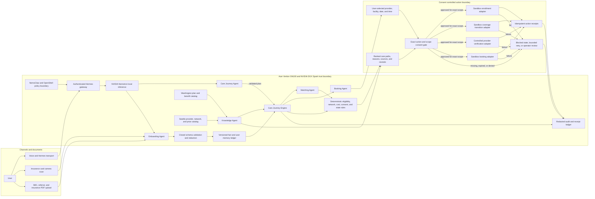
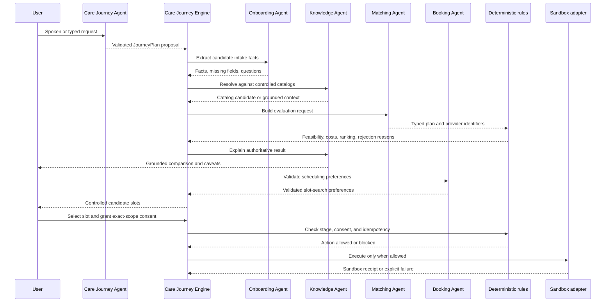
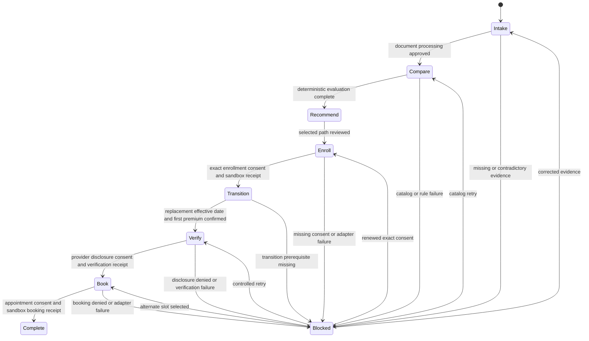

# VELA architecture

## System objective

VELA converts a spoken care request and user supplied insurance evidence into a source backed care path, requests exact consent for consequential actions, and completes a controlled sandbox appointment workflow. One Care Journey Engine owns the state machine and all authoritative decisions. Agents are bounded capabilities around that engine.

## End to end architecture



## Agent topology and contracts

VELA uses bounded agents around one deterministic authority. The agents classify,
extract, request, and explain; the Care Journey Engine validates their outputs,
owns workflow state, performs authoritative calculations, enforces consent, and
decides whether an adapter may run. An agent output is a proposal or a typed
request, never proof that an action occurred.

| Agent | Implementation | Inputs | Validated output | Explicitly cannot |
| --- | --- | --- | --- | --- |
| Care Journey Agent | `src/abyss/care_journey_agent.py` | User message, active journey identifier, and a compact user-care context | A closed-schema `JourneyPlan` containing intent, target identifiers, proposed steps, reusable context, refresh requirements, and missing fields | Mutate state, select coverage, calculate cost, grant consent, or execute an action |
| Onboarding Agent | `src/abyss/agents.py` | User text or supported synthetic document text, source identifier, and existing intake context | Candidate `DecisionFact` records plus missing fields and clarification questions | Verify its own facts, infer absent benefits, determine eligibility, or make a recommendation |
| Knowledge Agent | `src/abyss/agents.py` | Deterministic evaluations, controlled catalog results, and the user's question | A grounded explanation or a procedure-catalog candidate | Create catalog facts, recalculate an evaluation, resolve an ambiguous procedure without confirmation, or change an authoritative result |
| Matching Agent | `src/abyss/agents.py` | Candidate plan identifiers, provider identifier, and optional care-path context | A typed `MatchingRequest` and, after evaluation, a grounded explanation of feasibility and constraints | Rank plans, determine network status, calculate annual cost, or return a self-authored recommendation |
| Booking Agent | `src/abyss/booking.py` | Synthetic scheduling language and a deterministic default date | Validated date range and time-of-day preferences used by the engine to search controlled slot inventory | Select a slot, disclose information, book, cancel, or reschedule an appointment |

The booking boundary also includes a deterministic `SchedulerAgent` helper in
`src/abyss/agents.py`. It constructs the exact provider, facility, date, and
time scope presented for consent. It does not execute the booking. Only the
Care Journey Engine may call the sandbox booking service after matching that
scope to a valid, unexpired consent record and the current workflow stage.

The Care Journey Agent and Care Journey Engine are intentionally different:
the agent proposes how to route a message, while the engine decides whether
that proposal is valid and performs the allowed state transition.



## Components

| Component | Responsibility | Authority boundary |
| --- | --- | --- |
| Communication adapter | Normalize voice, typed, and messaging events | Cannot determine eligibility or invoke action adapters |
| Care Journey Agent | Classify a message and propose bounded routing across care journeys | Cannot mutate journey state or execute its proposed steps |
| Onboarding Agent | Extract candidate facts, classify documents, and identify missing information | Candidate facts remain unverified until validated or confirmed |
| Document ingestion | Accept camera images and PDFs, parse supported fields, and retain provenance | Cannot infer benefits that are absent from the source document |
| Fact and memory ledger | Preserve known, inferred, missing, contradictory, verified, and superseded facts | Never overwrites history or silently promotes confidence |
| Knowledge Agent and catalog services | Resolve procedure candidates and explain source-backed catalog and evaluation evidence | Retrieval and explanation only; cannot invent facts or change an evaluation |
| Matching Agent | Create typed evaluation requests and explain returned constraints | Deterministic rules retain feasibility, cost, network, and ranking authority |
| Booking Agent | Extract scheduling preferences used to search controlled slot inventory | Cannot select, book, cancel, or reschedule a slot |
| Care Journey Engine | Coordinate commands, facts, evaluations, consent, adapters, and events | Sole workflow authority |
| Deterministic rules | Calculate annual cost and enforce eligibility, network, consent, and state rules | Model output cannot override a rule result |
| Sandbox adapters | Simulate enrollment, transition, provider verification, and booking | Require exact consent, valid stage, and idempotency key |
| Audit ledger | Record facts, approvals, state changes, failures, and action receipts | Read only to user and review agents |

## Local NVIDIA execution

```text
Web or iPhone application
        |
        | authenticated application request
        v
VELA Care Journey Engine
        |
        | OpenAI compatible request over a private SSH tunnel
        v
NemoClaw Hermes gateway on the GN100
        |
        | policy controlled local inference
        v
NVIDIA Nemotron 3.5 Lightning on NVIDIA GB10
```

The application never calls the vLLM server directly. Tailscale and SSH protect access to the host. The Hermes token authenticates the application. NemoClaw controls model and network execution. VELA separately enforces healthcare domain consent, evidence, and state rules. No single layer replaces another.

DGX Spark is useful here because VELA can keep the model, retrieval context, document processing, and long running workflow state on a local system. That reduces the need to transmit sensitive care and insurance context to a hosted model and provides predictable conversational latency. Deterministic comparison continues to function if Nemotron is unavailable, while language dependent steps fail closed or request operator review.

## Performance evolution

VELA was optimized around the latency a user actually experiences: finding
catalog evidence, recognizing the end of a spoken turn, routing a request,
producing grounded language, and beginning audio playback. The most important
improvements on the `main` lineage are:

| Area | Optimization | Observed or structural result |
| --- | --- | --- |
| Hospital catalog | Removed a low-selectivity `estimable` index that caused SQLite to choose it instead of the `(code, code_type)` index | A documented development lookup fell from 96 seconds to 0.6 seconds, approximately 160x faster |
| Catalog search and health | Uses exact-code lookup first, bounds the FTS/BM25 candidate set to 4,000 rows, and reads the analyzed rate count from `sqlite_stat1` instead of scanning the full table | Keeps fallback search and health checks bounded over the multi-million-row catalog |
| Care routing | Exact pending replies and unmistakable new-care requests use narrow deterministic classifiers before invoking Hermes | A sufficiently explicit request can avoid both the supervisor and fact-extraction model round trips |
| Hermes decoding | Routing, extraction, explanation, booking, and phrasing calls have purpose-specific output limits from 150 to 500 tokens and normally use temperature zero | Bounds generation work and makes schema validation more predictable |
| Voice endpointing | Browser silence hangover changed from ten to eight 128 millisecond chunks | Submits a completed spoken turn approximately 256 milliseconds sooner |
| Speech synthesis | The deployed Magpie voice changed from `Mia.Calm` to `Mia.Neutral` | The same development sentence was documented at about 4.0 seconds instead of 6.2 seconds, roughly 35 percent lower synthesis time |
| Perceived responsiveness | Care-agent work begins concurrently with a short, non-committal spoken acknowledgement, and Magpie audio is streamed in chunks | Overlaps reasoning with acknowledgement playback and reduces the silent wait before the user hears a response |
| Mobile intake | Card captures are resized to 1,600 pixels at 80 percent quality and OCR runs in the browser | Reduces upload size and avoids a hosted vision-model round trip |

### Hermes context and call budget

Hermes receives a compact, redacted care snapshot rather than the complete
database record. It contains selected intake facts, minimal active-plan data,
journey and appointment summaries, and current scheduled tasks. Agent-event
history, credentials, raw documents, and full catalog rows are excluded. JSON
is serialized without optional whitespace, model outputs are validated against
closed schemas, and an invalid schema receives at most one corrective retry.

The deterministic fast paths are intentionally narrow. They activate only when
the transport or literal wording provides enough source-backed evidence; an
ambiguous request still uses Nemotron. A fully specified common care request can
therefore use zero Hermes calls, while an incomplete explicit request may use
one call to phrase the remaining deterministic question. More ambiguous intake
can require separate routing, extraction, and phrasing calls.

Context quality grew with product capability. The supervisor prompt expanded
from 580 characters in the first multi-journey implementation to 1,896
characters after plan comparison and discovery were added. That improves
routing coverage but increases prompt processing. The current care snapshot
also includes every journey and appointment for the member, so a production
version should cap or summarize older records.

### Measurement boundary

The 96-to-0.6-second catalog result and 6.2-to-4.0-second speech result are
development observations recorded alongside their optimizations. The 256
millisecond endpointing improvement follows directly from the browser's 16 kHz
audio chunks. They are not a standardized end-to-end benchmark and should not
be presented as production p50 or p95 latency.

Durable care-agent traces currently record outcome, correlation, and recovery
information, but not useful stage durations. A complete performance harness
should separately record ASR completion, Hermes queue and generation time,
catalog query time, TTS first byte and completion, and total voice-turn latency.

## Model and deterministic responsibility split

### NVIDIA Nemotron may

- Extract candidate facts from a conversation or supported document.
- Classify closed set intents and document types.
- Normalize procedure, plan, provider, and facility names.
- Identify ambiguity and propose a clarification question.
- Explain deterministic evaluations using supplied evidence.
- Summarize an audit history without changing it.

### NVIDIA Nemotron may not

- Calculate authoritative annual costs.
- Decide eligibility or network status.
- Rank plans or providers.
- Mark evidence verified.
- Approve consent.
- Advance workflow state.
- Execute enrollment, coverage transition, disclosure, or booking.

Every model response is treated as untrusted input. VELA validates it against a closed schema, rejects unknown actions, permits at most one bounded corrective retry, and moves repeated failures into a visible blocked or operator review state.

## Fact provenance

Every material fact carries:

```text
fact identifier
name and value
source
observed timestamp
confidence
verification status
consent requirement
optional effective and end dates
```

The interface and audit stream distinguish source facts, model proposed facts, deterministic calculations, and natural language explanations. A fluent explanation is never displayed as the source of a cost or eligibility result.

## State machine and consent



Enrollment approval, coverage transition approval, provider disclosure approval, and appointment booking approval are separate records. Transition cannot execute until the new effective date and first premium conditions are confirmed. Adapters require an idempotency key so a retry cannot silently duplicate an action.

## Failure and recovery behavior

| Failure | Safe behavior | Recovery |
| --- | --- | --- |
| Ambiguous MRI description | Do not assign a billing code | Ask whether the study is with or without contrast |
| Missing plan benefit | Mark the estimate incomplete | Request an SBC or display the bounded information available |
| Unverified network status | Exclude or flag the path | Retrieve a controlled source or request confirmation |
| Invalid model schema | Reject the output | One corrective retry, then operator review |
| Hermes unavailable | Preserve deterministic results | Continue without model explanation or retry locally |
| Missing or denied consent | Do not call the adapter | Explain the scope and wait for an explicit decision |
| Duplicate action request | Do not repeat the action | Return the existing receipt by idempotency key |
| Transition prerequisites missing | Keep old coverage unchanged | Confirm replacement effective date and first premium |
| Adapter failure | Record a failed event without claiming completion | Retry safely or select another controlled option |

## Data flow

1. The communication layer normalizes the channel event, and the Care Journey
   Agent proposes a closed-schema intent and routing plan.
2. The Care Journey Engine validates the plan against current journey and
   appointment identifiers before executing any proposed step.
3. Document ingestion supplies source text, and the Onboarding Agent proposes
   candidate facts and clarification questions.
4. Schema validation and user confirmation determine fact status; the ledger
   appends accepted facts with provenance and preserves corrections.
5. The Knowledge Agent resolves procedure candidates against the controlled
   catalog and identifies ambiguity without creating missing facts.
6. The Matching Agent creates a typed evaluation request from known plan and
   provider identifiers. Deterministic rules calculate feasibility, annual
   cost, network constraints, ranking, and rejection reasons.
7. The Knowledge or Matching Agent explains the authoritative evaluation using
   only supplied evidence and cannot alter the result.
8. At the booking stage, the Booking Agent extracts scheduling preferences; the
   engine searches controlled inventory and the user selects a specific slot.
9. The user grants or denies consent scoped to the exact proposed action. Each
   enrollment, transition, disclosure, booking, and cancellation action has a
   separate consent record.
10. The engine validates consent, workflow stage, prerequisites, selected
    identifiers, and idempotency before invoking an adapter.
11. A controlled or sandbox adapter executes and returns a receipt or an
    explicit failure; the audit ledger records the request and outcome.

## Security boundaries

- Real patient and insurance data must not enter the repository.
- Raw uploaded documents and secrets remain outside version control.
- The GN100 dashboard, Hermes gateway, and vLLM ports are never publicly exposed.
- Model prompts use compact, redacted journey snapshots.
- Provider disclosure is minimized to the exact approved scope.
- Logs omit bearer tokens, request headers, and raw sensitive payloads.
- Sandbox receipts can never be represented as real enrollment or booking confirmation.

See [SECURITY.md](SECURITY.md), [DEMO_TRUTH.md](DEMO_TRUTH.md), and [DATA_PROVENANCE.md](DATA_PROVENANCE.md).
