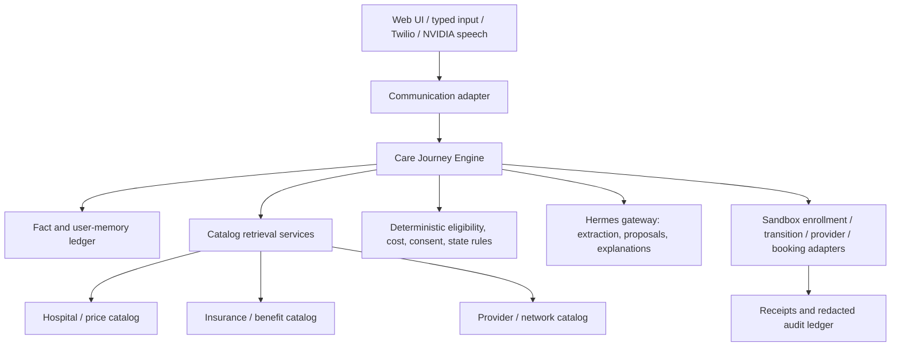

# VELA Implementation Project Plan

## Goal

Implement one truthful, end-to-end seeded demo: a Washington user who recently lost employer coverage requests a non-emergency MRI, compares three plans, selects the lowest expected annual-cost path subject to provider and medication constraints, approves sandbox enrollment and coverage transition, verifies a provider, and books a sandbox appointment.

VELA is not medical advice, a licensed broker, production enrollment, or production booking.

## Architecture decision

Build one Care Journey Engine as the authority. Agents are bounded capabilities around the engine; they are not independent autonomous decision makers.



### Why this architecture

- Deterministic code owns eligibility, network constraints, cost math, ranking, consent, state transitions, and action authorization.
- Catalog services retrieve evidence; they do not make recommendations.
- Models handle language-heavy work: extraction, classification, summarization, and explanation.
- Every action is adapter-backed, sandbox-only, consented, idempotent, and auditable.
- Missing, stale, or contradictory facts produce a visible blocked state rather than a guessed answer.

## Agent and service boundaries

| Role | Trigger | Allowed work | Prohibited work | Output |
|---|---|---|---|---|
| Communication adapter | User speaks, types, or sends a message | Normalize channel events, maintain session context, validate transport metadata | Decide eligibility or call action adapters directly | Normalized user intent |
| Onboarding Agent | New request or document arrives | Extract candidate facts, classify documents, identify missing fields | Treat extraction as verified; invent values | Schema-validated fact proposals |
| Knowledge Agent | User needs explanation or terminology help | Explain sourced facts, plan terms, calculations, caveats, and rejection reasons | Rank plans, alter facts, provide medical advice | Bounded explanation |
| Matching Agent | Minimum facts are available | Request deterministic matching and explain constraint failures | Override network, cost, or eligibility results | Evaluation request and explanation proposal |
| Scheduler Agent | Provider and appointment search is authorized | Prepare a sandbox booking request and summarize slots | Book without exact consent or receipt | Validated booking proposal |
| Review Agent | Journey summary or operator review is requested | Summarize evidence, events, blocks, and receipts | Change state or conceal failures | Review summary |
| Voice / Inbox Agent | Voice or SMS input arrives | Convert speech/text into a closed intent and read back engine output | Directly invoke enrollment, transition, or booking | Closed-schema intent |
| Catalog services | Engine needs source data | Retrieve and freshness-check hospital, plan, benefit, and network records | Infer unverified network or price facts | Source-backed records |
| Deterministic engine | Every journey command | Validate facts, calculate, rank, gate, transition state, authorize tools | Delegate authority to a model | State transition or blocked result |

## Model and NVIDIA / Hermes integration

### Hermes gateway

All model calls go through the authenticated Hermes gateway configured with:

```text
HERMES_BASE_URL
HERMES_API_KEY
HERMES_MODEL
```

The application must never call a local vLLM port directly and must not silently fall back to a hosted model. Request headers and API keys must not be logged.

Hermes receives a compact, redacted snapshot rather than the full database:

```json
{
  "journey_stage": "RECOMMEND",
  "allowed_actions": ["explain_recommendation"],
  "facts": ["fact_123", "fact_456"],
  "path_evaluations": ["eval_1", "eval_2", "eval_3"],
  "missing_facts": [],
  "consent_required": null
}
```

Hermes responses must use closed schemas. Validate every response, reject unknown actions, perform at most one corrective retry, and route repeated invalid output to `needs_operator`.

### NVIDIA Nemotron

Use NVIDIA Nemotron through Hermes for language tasks that benefit from a strong local or approved enterprise model, subject to the available Hermes model configuration. Nemotron may be used for:

- document and conversation fact extraction;
- intent classification;
- normalization of procedure, plan, provider, and facility names;
- concise explanation of deterministic results;
- summarization of audit history and missing evidence.

Nemotron must not own:

- annual-cost calculations;
- eligibility or network decisions;
- plan ranking;
- consent validation;
- state transitions;
- enrollment, coverage transition, provider disclosure, or booking.

The model output is untrusted input until it passes schema validation and deterministic rule checks.

### NVIDIA speech services

Add speech only after the typed vertical path works. NVIDIA ASR converts speech to text and NVIDIA TTS reads back approved engine output. Speech is a transport layer, not an authority layer. Voice commands become the same normalized intents used by the web UI.

## Data contracts

Preserve the existing `src/abyss/domain.py` contracts and expand them only compatibly.

### Decision fact

Every material fact requires:

```text
fact_id
name
value
source
observed_at
confidence
verification_status
consent_required
effective_at / ends_at
```

### Path evaluation

```text
plan_id
provider_id
facility_id
procedure_code
feasible
annual_cost_components
hard_failures
missing_facts
fact_ids_used
source_ids_used
calculated_at
```

### Action receipt

```text
receipt_id
action
journey_id
consent_id
sandbox
status
timestamp
idempotency_key
artifact_reference
```

## Implementation phases

### Phase 0: Baseline and contracts

- Review existing `domain.py`, `cost_engine.py`, `workflow.py`, `agent.py`, and `hermes_client.py`.
- Preserve deterministic semantics and existing tests.
- Define journey IDs, stages, command envelopes, event envelopes, and error codes.
- Add seeded synthetic scenario fixtures only.
- Confirm secrets and raw uploaded documents are excluded from version control.

Exit criteria: current tests pass and the golden-path data contracts are documented.

### Phase 1: Fact and memory ledger

- Implement sourced fact validation.
- Store fact status: known, inferred, missing, verified, contradictory.
- Add versioned memory records with effective dates and superseded pointers.
- Support correction and invalidation without overwriting history.
- Add consent records for document processing and data sharing.

Exit criteria: synthetic card, SBC, referral, and user statements create inspectable facts with provenance.

### Phase 2: Catalog retrieval

- Define interfaces for hospital, price, insurance, benefit, provider, and network catalogs.
- Load the seeded Washington plan set.
- Load the initial Seattle/Puget Sound hospital and MRI price references.
- Track source URL, manifest, retrieval time, freshness, parser version, and match confidence.
- Return explicit `not_found`, `formula_only`, `unconfident_match`, and `source_unavailable` states.

Exit criteria: catalog queries are deterministic, source-backed, and do not infer network status from price data.

### Phase 3: Care Journey Engine

- Implement explicit stages: `INTAKE`, `COMPARE`, `RECOMMEND`, `ENROLL`, `TRANSITION`, `VERIFY`, `BOOK`, `COMPLETE`.
- Implement `record_fact`, `record_consent`, `advance`, and snapshot APIs.
- Reject invalid stage transitions.
- Block on missing or contradictory required facts.
- Make all adapter commands idempotent.

Exit criteria: a journey can move from intake to recommendation without any model dependency.

### Phase 4: Eligibility and cost evaluation

- Implement plan-effective-date selection.
- Evaluate provider, facility, medication, and coverage constraints.
- Calculate transparent annual-cost components.
- Rank only feasible paths.
- Preserve rejection reasons and fact/source IDs used.
- Add tests for overlapping plans, stale facts, out-of-network providers, missing prices, and first-premium conditions.

Exit criteria: the three-plan golden scenario produces the expected recommendation and rejection reasons deterministically.

### Phase 5: Bounded Hermes / Nemotron agents

- Implement onboarding extraction through `hermes_client.py`.
- Implement Knowledge Agent explanation over engine snapshots.
- Implement Matching Agent as a bounded evaluation request wrapper.
- Add response schemas, redaction, timeouts, retry limits, and invalid-output handling.
- Add model fakes for unit tests; integration tests must use the authenticated Hermes configuration only.
- Log model metadata and validation outcomes, never secrets or raw sensitive payloads.

Exit criteria: turning the model off still leaves deterministic evaluation and safe blocking behavior intact.

### Phase 6: Consent and sandbox adapters

- Implement exact-scope consent checks.
- Add sandbox enrollment, transition, provider-verification, and booking adapters.
- Enforce the sequence: new effective date and first premium before ending old coverage.
- Return receipts with status, timestamp, consent ID, and idempotency key.
- Ensure duplicate commands do not produce duplicate actions.

Exit criteria: no material action can execute without matching consent and valid journey state.

### Phase 7: Web journey and voice transport

- Connect the existing web UI to journey snapshots and evidence displays.
- Show known, inferred, missing, contradictory, and verified states distinctly.
- Add typed request flow first.
- Add NVIDIA ASR/TTS through a capability-gated communication adapter.
- Add Twilio test messaging only after typed and voice flows are safe.

Exit criteria: a judge can complete the golden journey from request to sandbox appointment using the UI.

### Phase 8: Audit, demo hardening, and verification

- Add redacted event ledger views.
- Add a final journey summary with savings, sources, caveats, approvals, and receipts.
- Test replay, resume, duplicate requests, model failure, catalog unavailability, and consent expiry.
- Run the required test command:

```bash
PYTHONPATH=src python3 -m unittest discover -s tests -v
```

Exit criteria: the demo is truthful, reproducible, sandbox-only, and complete from onboarding through booking.

## First vertical slice

Implement this slice before broadening catalogs or adding channels:

```text
Seeded typed request
→ synthetic document extraction stub
→ fact ledger
→ three seeded plan evaluations
→ deterministic recommendation
→ explanation from Hermes/Nemotron
→ exact enrollment consent
→ sandbox enrollment receipt
→ transition precondition check
→ provider verification
→ appointment consent
→ sandbox booking receipt
```

Every unimplemented external seam should have a truthful sandbox adapter so the end-to-end path remains connected.

## Definition of done

A judge can watch VELA transform the seeded request into a personalized coverage decision and verified sandbox appointment, with:

- visible source-backed facts;
- explicit missing and unverified information;
- deterministic eligibility and annual-cost math;
- ranked feasible paths and rejection reasons;
- bounded model explanations;
- exact consent for each material action;
- safe coverage-transition sequencing;
- sandbox receipts and an immutable audit history.
