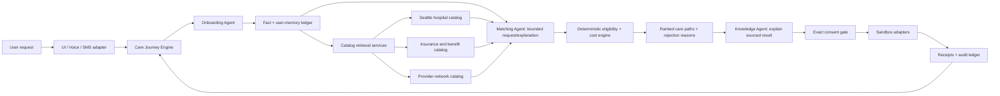

# ABYSS Example Journey: Coverage Change + Knee MRI

This document shows how one request moves through ABYSS. It uses seeded synthetic data for the hackathon. ABYSS is not medical advice, a licensed broker, production enrollment, or production booking.

## User request

> “I recently lost my employer coverage. I need a non-emergency knee MRI, and I want to keep seeing Dr. Lee at Seattle General. Help me compare my options.”

The request can arrive through the typed web UI, a Hermes conversation, a sandbox SMS channel, or a voice channel using NVIDIA speech services. The communication channel normalizes the request, but it does not decide what action to take.

```json
{
  "intent": "compare_coverage_for_care",
  "care_request": "knee_mri_without_contrast",
  "preferred_provider": "Dr. Lee",
  "preferred_facility": "Seattle General",
  "coverage_event": "employer_coverage_lost"
}
```

The Care Journey Engine creates a journey in `INTAKE`. No enrollment, coverage cancellation, provider disclosure, or appointment booking occurs at this point.

## End-to-end flow



## Step 1: Onboarding and fact extraction

The user uploads a synthetic insurance card, a summary of benefits, and a referral. The Onboarding Agent extracts candidate facts. The agent may classify, normalize, and identify possible gaps, but the extracted values are not authoritative until validated by deterministic code.

```json
{
  "facts": [
    {
      "name": "current_plan",
      "value": "Employer PPO",
      "source": "synthetic_insurance_card_001",
      "observed_at": "2026-08-15T16:00:00Z",
      "confidence": 0.98,
      "verification_status": "extracted",
      "consent_required": "PROCESS_DOCUMENTS"
    },
    {
      "name": "requested_procedure",
      "value": "MRI knee without contrast",
      "source": "synthetic_referral_001",
      "observed_at": "2026-08-15T16:00:00Z",
      "confidence": 0.94,
      "verification_status": "extracted",
      "consent_required": "PROCESS_DOCUMENTS"
    },
    {
      "name": "preferred_provider",
      "value": "Dr. Lee",
      "source": "user_statement",
      "observed_at": "2026-08-15T16:01:00Z",
      "confidence": 1.0,
      "verification_status": "user_stated",
      "consent_required": null
    }
  ],
  "missing_facts": ["coverage_end_date", "service_date"]
}
```

The ledger distinguishes `known`, `inferred`, `missing`, `verified`, and `contradictory` facts. If a required fact is missing, the engine asks a focused question and remains in `INTAKE`.

## Step 2: Catalog retrieval

Once the minimum facts are present, the engine calls deterministic catalog services. There is no autonomous knowledge agent deciding what records to use.

The retrieval services fetch records using explicit keys:

```text
procedure_code: 73721
service_date: 2026-09-04
geography: Seattle / Puget Sound
preferred_facility: Seattle General
preferred_provider: Dr. Lee
```

The catalogs return source-backed records with freshness, source URLs or manifest IDs, observed timestamps, confidence, and verification status. A hospital price record does not imply plan-network participation. A plan record does not imply that a provider is in network.

## Step 3: Deterministic comparison

The Matching Agent requests an evaluation. It cannot override the result. The deterministic engine evaluates eligibility, network constraints, effective dates, medication or physician constraints, and expected annual cost.

Example result:

| Path | Feasible | Expected annual cost | Reason |
|---|---:|---:|---|
| Continuation PPO + Dr. Lee + Seattle General | Yes | $8,900 | All required constraints pass |
| Washington Plan A + Dr. Lee + Seattle General | No | — | Dr. Lee is out of network |
| Washington Plan B + Dr. Lee + Seattle General | Yes | $6,750 | All required constraints pass |

```json
{
  "recommended_path": "WA_PLAN_B",
  "annual_cost": 6750,
  "savings_vs_continuation": 2150,
  "hard_constraints_satisfied": [
    "provider_network_verified",
    "facility_network_verified",
    "service_date_eligible"
  ],
  "rejected_paths": [
    {
      "plan": "WA_PLAN_A",
      "reason": "preferred_provider_out_of_network"
    }
  ],
  "caveats": [
    "MRI amount is an estimate, not a guarantee of final patient responsibility"
  ]
}
```

## Step 4: Knowledge Agent explanation

The Knowledge Agent receives a compact, redacted engine snapshot and explains it in plain language. It does not calculate, rank, or invent facts.

> Plan B is the lowest-cost feasible path at an estimated $6,750 annually. It preserves access to Dr. Lee and Seattle General based on the current verification records. Plan A was rejected because Dr. Lee is out of network. The MRI cost is an estimate from the available price reference and is not a final guarantee.

The UI displays the explanation beside the evidence, calculation components, source records, unknowns, and rejection reasons.

## Step 5: Exact consent gates

The recommendation is not consent to act. Each material action has a separate scope:

```text
ENROLL_PLAN      → WA_PLAN_B
TRANSITION_COVERAGE → current coverage to WA_PLAN_B
SHARE_WITH_PROVIDER → Dr. Lee / Seattle General
BOOK_APPOINTMENT → Dr. Lee / Seattle General / 2026-09-04 10:30
```

Before every adapter call, deterministic code verifies the exact consent, current facts, preconditions, idempotency key, and journey stage. Old coverage cannot end until the new effective date and first-premium condition are confirmed.

## Step 6: Sandbox receipts and completion

Each successful adapter call returns a receipt and an audit event.

```json
{
  "action": "BOOK_APPOINTMENT",
  "status": "sandbox_confirmed",
  "sandbox": true,
  "provider": "Dr. Lee",
  "facility": "Seattle General",
  "date": "2026-09-04",
  "time": "10:30",
  "idempotency_key": "book_journey_001_01"
}
```

The journey advances explicitly:

```text
INTAKE → COMPARE → RECOMMEND → ENROLL → TRANSITION → VERIFY → BOOK → COMPLETE
```

The final summary shows the original request, source-backed facts, evaluated paths, recommendation, consent records, sandbox receipts, and complete audit history.
